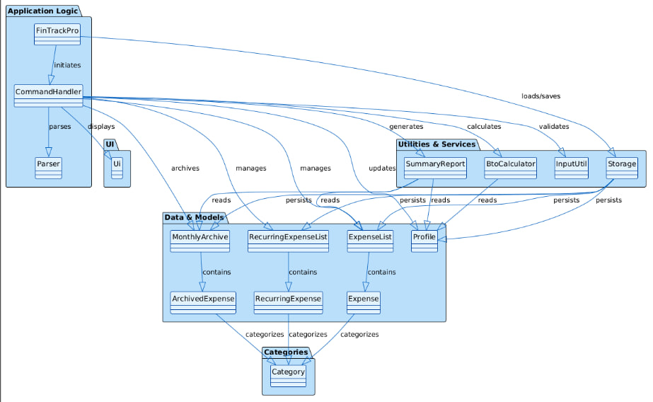
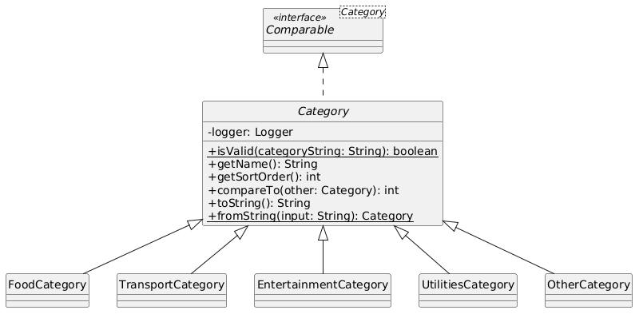

# 1. Developer Guide
This Developer Guide will showcase the design and implementation of FinTrackPro, a CLI-based financial
planning application for BTO downpayment goal tracking with the use of UML diagrams and code snippets.

It will also include instructions for manual testing of the product, along with a comprehensive list of 
test cases to ensure the robustness and reliability of the application. 

The guide is structured to provide a clear understanding of the architecture, design decisions, and testing 
strategies employed in the development of FinTrackPro.

## Table of Contents
* **2. [Acknowledgements](#2-acknowledgements)**
  * **2.1 [Frameworks and base code](#21-frameworks-and-base-code)**
  * **2.2 [Third-party libraries](#22-third-party-libraries)**
  * **2.3 [Educational resources](#23-educational-resources)**
* **3. [Design & Implementation](#3-design--implementation)**
  * **3.1 [Architecture Diagram](#31-architecture-diagram)**
  * **3.2 [UML Diagrams](#32-uml-diagrams)**
* **4. [Product Scope](#4-product-scope)**
  * **4.1 [Target user profile](#41-target-user-profile)**
  * **4.2 [Value proposition](#42-value-proposition)**
  * **4.3 [User stories](#43-user-stories)**
* **5. [Non-Functional Requirements](#5-non-functional-requirements)**
  * **5.1 [Performance and scalability](#51-performance-and-scalability)**
  * **5.2 [Data integrity](#52-data-integrity)**
  * **5.3 [Security and privacy](#53-security-and-privacy)**
  * **5.4 [Usability](#54-usability)**
  * **5.5 [Environment](#55-environment)**
* **6. [Glossary](#6-glossary)**
* **7. [Instructions For Manual Testing](#7-instructions-for-manual-testing)**
  * **7.1 [Test Cases](#71-test-cases)**

# 2. Acknowledgements

## 2.1 Frameworks and base code
* **[AddressBook-Level 3 (AB3)](https://se-education.org/addressbook-level3/)**: FinTrack Pro's architectural patterns and initial codebase were adapted from the AddressBook-Level 3 project created by the **[SE-EDU initiative](https://se-education.org/)**.
* **[JavaFX](https://openjfx.io/)**: Used for the Graphical User Interface (GUI) components of the application.

## 2.2 Third-party libraries
* **[JUnit 5](https://junit.org/junit5/)**: Utilized for unit testing and ensuring code reliability.
* **[Jackson](https://github.com/FasterXML/jackson)**: Used for JSON parsing and data persistence in the storage component.
* **[PlantUML](https://plantuml.com/)**: Used for generating all UML diagrams (Sequence, Class, and Object diagrams) within this documentation.

## 2.3 Educational resources
* **[SE-EDU Guides](https://se-education.org/guides/)**: We referred to the various guides provided by the SE-EDU team for best practices in software documentation and testing.
* **[CS2113 Module Website](https://nus-cs2113-ay2526s2.github.io/website/)**: Special thanks to the professors and tutors of CS2113 for their guidance and feedback throughout the development lifecycle of v1.0 to v2.1.

# 3 Design & Implementation

{Describe the design and implementation of the product. Use UML diagrams and short code snippets where applicable.}
## 3.1 Architecture Diagram

### Overview

The architecture is organized into layered components that interact with each other to deliver the application's core functionality: expense tracking, savings planning, and BTO downpayment goal management.

### Main Components

The app consists of the following main components:

1. **Main (FinTrackPro)**: Responsible for app launch and shutdown.
    - Initializes all other components in the correct sequence at startup.
    - Connects components together and establishes their dependencies.
    - Invokes cleanup methods during shutdown.

2. **UI**: The user interface layer of the app.
    - Displays messages and prompts to the user.
    - Handles all command-line interaction and output formatting.

3. **Logic**: The command execution engine.
    - **CommandHandler**: Receives user commands, parses them, and executes the corresponding business logic.
    - **Parser**: Receives and validates user input to extract command type and arguments.
    - Coordinates between UI, Data, and Storage components to fulfill user requests.

4. **Data**: Holds the data of the app in memory.
    - **Profile**: Manages user financial information (name, salary, savings, BTO goal, deadline).
    - **ExpenseList**: Manages the current month's regular expenses.
    - **Expense**: Represents a single expense entry with amount, category, and timestamp.
    - **RecurringExpenseList**: Manages monthly recurring expenses (e.g., subscriptions).
    - **RecurringExpense**: Represents a recurring expense that occurs every month.
    - **MonthlyArchive**: Manages archived monthly data when advancing to a new month.
    - **ArchivedExpense**: Represents a historical expense record from a previous month.

5. **Storage**: Reads data from and writes data to the hard disk.
    - Persists the Profile, ExpenseList, RecurringExpenseList, and MonthlyArchive to a local file.
    - Loads previously saved data at app startup for data continuity.
    - Ensures no data loss through auto-save functionality after state-changing commands.

6. **Categories**: A polymorphic system for expense classification.
    - **Category**: Abstract base class defining the categorization interface.
    - **FoodCategory, TransportCategory, EntertainmentCategory, UtilitiesCategory, OtherCategory**: Concrete category implementations.
    - Enables type-safe expense categorization and sorting by priority.

7. **Utilities**: A collection of helper classes used by multiple components.
    - **BtoCalculator**: Performs financial calculations for BTO goal planning (savings needed, progress tracking).
    - **InputUtil**: Validates and parses user input (amounts, dates, categories).
    - **LoggerUtil**: Provides centralized logging functionality for debugging and monitoring.

### How the Architecture Components Interact with Each Other

The sequence of interactions in a typical use case follows this pattern:

1. **App Initialization**: FinTrackPro initializes all components (Ui, Storage, Profile, ExpenseList, etc.) and loads persisted data from disk via Storage.

2. **User Input**: The user enters a command via the CLI. Ui captures this input as a string.

3. **Command Parsing and Execution**:
    - CommandHandler receives the input string.
    - Parser receives and validates the input to identify the command type and arguments.
    - CommandHandler interprets the parsed command and determines which Data components to interact with.

4. **Logic Execution**:
    - Depending on the command, Logic may:
        - **Add/Delete/Edit**: Modifies Data (ExpenseList, Profile, RecurringExpenseList) in memory.
        - **Validate**: Uses InputUtil and Category to ensure data correctness.
        - **Calculate**: Uses BtoCalculator to compute financial metrics.
        - **Archive**: Moves ExpenseList data to MonthlyArchive and resets for the new month.

5. **Data Persistence**: After a state-changing command, Storage automatically saves the updated Data (Profile, ExpenseList, RecurringExpenseList, MonthlyArchive) to the hard disk.

6. **Display Results**: Ui formats and displays the results or status message to the user via the CLI.

7. **App Shutdown**: Upon user exit, FinTrackPro invokes cleanup methods and shuts down all components gracefully.

This layered architecture promotes separation of concerns, making the codebase maintainable, testable, and scalable. 
The sections below give more concrete details about each component.

## 3.2 UML Diagrams
In this section, we will present the UML class diagrams, object diagrams and sequence diagrams to 
illustrate how each main component of FinTrackPro integrates with the rest of the codebase.

### Category component

### Archive Expenses 
#### Class Diagram

The above class diagram illustrates the design of the month archiving feature and the classes that directly participate
in it. 

CommandHandler triggers the archival through the `save` command, while FinTrackPro retrieves archived records during `list` display.
Both classes depend on MonthlyArchive as the archive service class. 

MonthlyArchive is responsible for persisting and loading monthly archive data, and it produces ArchivedExpense objects when archived
entries are read back from storage. 

For data sources, MonthlyArchive reads from both ExpenseList and RecurringExpenseList, accessing individual Expense and RecurringExpense
items. All archived entries are represented uniformly as ArchivedExpense, so listing logic can display historical records through a consistent
format.

#### Sequence Diagram

The ArchiveExpense sequence diagram illustrates two runtime flows: saving a month and displaying archived history. 

In the save flow, the user enters the `save` command, and CommandHandler creates and uses MonthlyArchive, and invokes monthly save logic. MonthlyArchive
iterates through current one-time and recurring expense collections, then writes archive rows into the month's archive file (MonthN).

After successful persistence, control returns to CommandHandler, which continue month advancement and post-save updates. 

In the list flow, the user enters `list`, and FinTrackPro requests archive data from MonthlyArchive for previous months. MonthlyArchive
reads each MonthN file and reconstructs rows as List<ArchivedExpense>. FinTrackPro then iterates through these archived entries (name, amount, category)
to print month-grouped history and totals.

# 4 Product Scope

## 4.1 Target user profile
FinTrack Pro was created for individual students in a relationship who are planning to set aside finances for their share of a BTO downpayment.

## 4.2 Value proposition
An individual BTO budget planner for university students planning to apply for BTO that turns messy finances into a clear downpayment plan - showing how much the individual needs to save and whether additional financing is required.

## 4.3 User Stories

| Version | As a ...       | I want to ...                        | So that I can ...                                                                 |
|---------|----------------|--------------------------------------|-----------------------------------------------------------------------------------|
| v1.0    | New User       | Add regular expenses                 | Track all costs that might slow down my progress toward my goals                  |
| v1.0    | New User       | Add my salary                        | Visualize my spending proportions relative to my total income                     |
| v1.0    | New User       | Add my savings                       | Track my current liquid assets compared to my target goal                         |
| v1.0    | New User       | Add ratio of downpayment             | Establish a concrete savings goal to pay my share of my future home               |
| v1.0    | New User       | Add downpayment price                | Adjust the downpayment to its actual value, since BTO flats are priced differently|
| v1.0    | New User       | Delete entries                       | Update my list to only show relevant expenditures                                 |
| v1.0    | New User       | Edit entries                         | Correct input errors or update my salary to reflect my current financial status   |
| v1.0    | New User       | View a financial summary             | Visualize my progress toward the downpayment goal in one glance                   |
| v2.0    | New User       | Categorize expenses                  | Identify which spending categories occupy the largest portion of my budget        |
| v1.0    | New User       | View "Distance to Goal" metrics      | Stay motivated by seeing exactly how close I am to reaching my downpayment target |
| v1.0    | New User       | View salary and savings              | Know how much I am saving relative to my salary                                   |
| v1.0    | New User       | Have a help command                  | Easily use the app's commands                                                     |
| v2.0    | Regular User   | Add recurring monthly expenses       | Never be blindsided by hidden or automated costs that occur every month           |
| v2.0    | Regular User   | Add comments to expenses             | Provide context for specific spending habits to better understand them later      |
| v1.0    | Regular User   | Set a specific target date           | Know the monthly savings rate needed to meet my deadline                          |
| v1.0    | Regular User   | Sort expenditure from highest to lowest | Know which expenditures are hindering me from reaching my downpayment goal     |
| v2.0    | Long Term User | Archive financial phases monthly     | Keep my dashboard uncluttered while preserving historical data                    |
| v2.0    | Long Term User | Assign a financial readiness level   | Know how ready I am to pay off my share of the downpayment                        |
| v1.0    | Long Term User | Have a local database                | View all past inputs and historical data                                          |

# 5 Non-Functional Requirements

##  5.1 Performance and scalability
* Response Time: Any command should return a result within 200 milliseconds under normal operating conditions.
* Capacity: The system should be able to handle up to 1,000 unique expenditure entries and 5 years of archived monthly data without any perceptible degradation in performance or lag in CLI responsiveness.

## 5.2 Data integrity
* Auto-save: To prevent loss of critical financial planning data, the application must automatically save the state of the budget and expenses to the local database after every valid state-changing command. 
* Fault Tolerance: The application should not crash or corrupt the local database if the user inputs malformed data. Instead it should provide a clear, non-technical error message and maintain the previous valid state.

## 5.3 Security and privacy
* Local Storage Only: Since the application handles sensitive information like salary, savings, and BTO targets, all data must be stored locally on the user's device. No financial data should be transmitted over a network or stored in the cloud.

## 5.4 Usability
* CLI Efficiency: The system is designed for "Power Users." An experienced user (typing at 50+ WPM) should be able to input a new expense and view their updated "Distance to Goal" faster than they could using a standard spreadsheet or mobile banking app.
* Documentation: A user who has never used a CLI should be able to perform basic tasks (adding salary/savings) within 5 minutes of reading the help command or the User Guide.

## 5.5 Environment
* Platform Independence: The application must be cross-platform, functioning identically on Windows, macOS, and Linux distributions, provided the system has Java 17 installed.
* Zero Installation: The product should be delivered as a single, executable JAR file that requires no complex installation process or external database setup. 

# 6 Glossary

* *BTO (Build-To-Order)* - a subsidized public housing option scheme in Singapore where new flats are constructed only after a sufficient number of units (typically 65-70%) have been pre-booked by applicants
* *Contribution ratio* - the user's fractional share of the downpayment (0.0 to 1.0)
* *Recurring expenses* - expenses that occur on a monthly basis following the same rates (eg Netflix subscription of $5.98/month), then you can run `addrecurring Netflix Subscription 5.98 entertainment recurring`
* *Adjusted Minimum Savings* - minimum amount you need to save per month given your distance to goal and number of months remaining till the deadline 
* *Estimated Goal Achievement* - number of months you need to take to achieve your goal, given the current month's savings and distance to goal

# 7 Instructions for Manual Testing

{Give instructions on how to do a manual product testing e.g., how to load sample data to be used for testing}

## 7.1 Test cases

### Managing expenses
(to be added by Kynaston)

---

### Sorting expenses

1. **Sorting by category**
    1. Prerequisites: Multiple expenses of different categories in the list.
    2. Test case: `sort category` Expected: Expenses reordered in category priority: FOOD, TRANSPORT, ENTERTAINMENT, UTILITIES, OTHER.
    3. Test case: `sort recent` Expected: Expenses reordered back to insertion order.
    4. Test case: `sort foo` Expected: List order unchanged. Error shown for unrecognized argument.
    5. Other incorrect sort commands to try: `sort` (empty argument) Expected: Similar to previous.

---

### Managing profile
(to be added by Adam)
---

### Reset and clear
(to be added by Jairus)
---

### Category validation

1. **Parsing a category from string**
    1. Test case: `FOOD`, `food`, `fOoD` Expected: All resolve to a `FoodCategory` instance (case-insensitive).
    2. Test case: `TRANSPORT`, `ENTERTAINMENT`, `UTILITIES`, `OTHER` Expected: Each resolves to its corresponding category class.
    3. Test case: `HELLO` Expected: `IllegalArgumentException` thrown.
    4. Test case: `Category.isValid("FOO")`, `Category.isValid("hello")` Expected: Returns `false`.

2. **Category sort ordering**
    1. Test case: Compare FOOD → TRANSPORT → ENTERTAINMENT → UTILITIES → OTHER. Expected: Each preceding category compares as less than the next, confirming sort priority.

---

### Archive Expenses

1. **Archiving current month with `save`**
    1. Prerequisites: At least 1 regular expense exists in the current month (e.g., `add lunch 10 food`).
    2. Test case: `save` Expected: Current month's expenses are archived, month advances by 1, and monthly expense list is reset.
    3. Test case: Run `list` after `save` Expected: Archived month section is shown, and current month has no regular expenses yet.
    4. Test case: Run `save` immediately again (no new regular expenses added) Expected: New month is still created and advanced; archive for that month is empty.
    5. Test case: Add expenses that exceed allowance, then run `save` Expected: Month still archives and advances; no unspent allowance is transferred.

---

### Monthly Archive

1. **Viewing archived month history**
    1. Prerequisites: At least 1 month has been archived via `save`.
    2. Test case: `list` Expected: Output includes monthly sections in order (e.g., `*** MONTH 1 EXPENSES`, `*** MONTH 2 EXPENSES`) with expenses grouped under each month.
    3. Test case: In the newest month with no expenses, run `list` Expected: Earlier month sections still appear; current month shows no regular expenses recorded yet.
    4. Test case: Restart the app, then run `list` Expected: Archived month sections are reloaded from storage and remain visible.

2. **Incorrect commands related to archiving**
    1. Test case: `savee` Expected: Command is rejected as invalid; no month advancement or archive changes.
    2. Test case: `save month` Expected: Treated as invalid command format; archive data remains unchanged.

